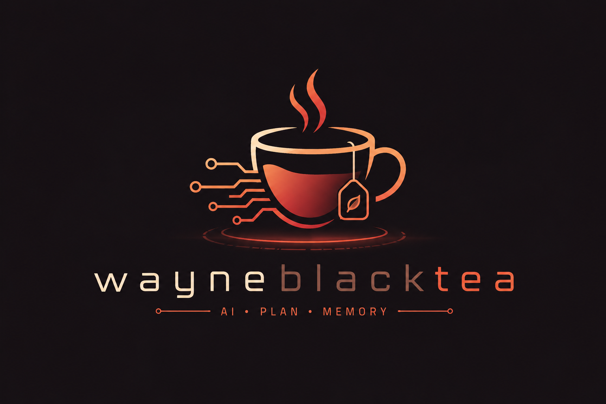

  

  <strong>English</strong> | <a href="README.zh-TW.md">繁體中文</a>

  

  A personal-OS server for AI agents — your goals, decisions, knowledge,
  and learning live in one shared brain so the AI you work with already
  knows your context instead of asking you to re-explain it every
  conversation.

---

## Why this exists

Most AI workflows are stateless. Every conversation starts from zero,
every agent is amnesiac, and you spend the day re-pasting links and
explaining yesterday's context. The more agents you add — an editor
assistant, a Discord helper, a daily summariser — the worse it gets.
Each one produces output the others never see, and you become the only
piece of memory in the system.

wayneblacktea takes the opposite position: model your work as
**structured data** — goals, projects, tasks, decisions, knowledge
items, concept cards, agent proposals, session handoffs — and let
every agent read and write the same store. When you ask the editor
"what was I doing yesterday?", it pulls a real answer from a real
schema. When you save a link from Discord, the system can later
propose a spaced-repetition card from it without you typing again.
When you confirm a plan, the phases become real tasks atomically.

The AI you work with already knows your context. You stop being the
clipboard.

## What this enables

- **Editor, Discord, and dashboard agree on state.** Save a link in
  Discord, see it on the dashboard a second later. No "wait did I
  tell you about this".
- **Saved knowledge feeds the review queue.** When you file an
  article or a TIL, the system drafts a spaced-repetition card for
  it. You confirm or skip — the queue grows from your reading habit
  instead of from extra effort.
- **Decisions are queryable.** Architectural choices, tradeoffs, and
  the alternatives you considered all live in one log. Six weeks
  later "why did I do X this way" returns a real answer.
- **Agent proposals stay proposals.** Anything an agent suggests with
  permanent consequences — a new goal, a new project, a new concept
  card — goes into a pending queue. You confirm or reject. Ownership
  of your agenda stays with you.
- **Cross-session continuity.** "Next time I'll keep working on Y" is
  a structured note the next session sees first. No retelling.
- **Anti-amnesia signals.** The server tracks tool-call patterns and
  surfaces hints when something is being forgotten — stuck
  in-progress tasks, pending proposals piling up, decisions logged
  without a session-start recall. The AI cannot enforce its own
  discipline; making the gap visible is the next-best layer.

## How it is organised

Seven bounded contexts. Each owns a slice of the model and a
narrowly-defined vocabulary; conflating them breaks the system.

| Context | What it owns |
|---|---|
| **GTD** | Goals → projects → tasks (with importance and discussion context), plus an activity log. |
| **Decisions** | Architectural and design decisions with rationale and alternatives. |
| **Knowledge** | Articles, TILs, bookmarks, Zettelkasten notes — full-text and semantic search, deduplicated at ingest. |
| **Learning** | Spaced-repetition concept cards on an FSRS schedule. The system can auto-propose cards from saved knowledge. |
| **Sessions** | Cross-session handoff notes — "what to continue next time". |
| **Proposals** | Agent-originated entities awaiting user confirmation. |
| **Workspace** | Tracked Git repos with status, known issues, and the next planned step. |

Every entity carries an optional workspace scope, so multiple
isolated personal stores can share the same instance.

## Design philosophy

**Structure over prompts.** Memory files and giant context windows
are the conventional path to "AI knows me". The opposite path is
more honest: encode the parts of your life you want the AI to
remember as explicit schema, and let every agent read the same
model. No drift between agents, no "I think you mentioned…", just
the data.

**The user keeps the call.** Agents propose; you confirm.
High-commitment entities flow through a pending queue rather than
being created directly. The friction is the point — a system that
decides for you eventually makes you worse at deciding.

**Make forgetting visible.** Even the most disciplined agent forgets
to close out work. Rather than hoping it remembers, the server
records every tool call and exposes a readout that names the
patterns — *several tasks added, none completed*; *pending proposals
piling up*. A small hook copies the same readout to disk so the next
session sees the leftovers before the user types.

**Workflow tools, not raw CRUD.** The agent surface offers
operations like *get today's context*, *confirm a plan*, *log a
decision*, *file a session handoff*. The schema is hidden behind
verbs; rules live in the tool layer, not in prompt instructions
scattered across clients.

## Scope and limits

- **Single-tenant by design.** One human, many agents. No team mode,
  no role-based access. If you fork to self-host for yourself, the
  workspace scope keeps your data isolated; if you want to invite
  collaborators, this is not it.
- **Personal pace.** Built and run by one person. Releases are
  irregular, breaking changes will happen, the dashboard is
  unstyled in places.

## Running it

Self-hosting instructions, environment variables, and the contributor
workflow live in [docs/installation.md] and [CONTRIBUTING.md].

## License

[MIT](./LICENSE).

[docs/installation.md]: ./docs/installation.md
[CONTRIBUTING.md]: ./CONTRIBUTING.md
