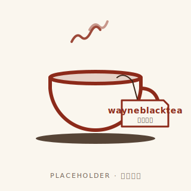

<p align="center">
  <!-- TODO: replace with the real logo once designed.
       See docs/logo-brief.md for the design direction (matcha-leaf monogram). -->
  
</p>

<p align="center">
  <strong>wayneblacktea</strong>
</p>

<p align="center">
  A personal-OS server for AI agents — your goals, decisions, knowledge,
  and learning live in one shared brain instead of being re-explained to
  every chatbot every conversation.
</p>

---

## Why this exists

Most AI workflows are stateless. Every conversation starts from zero,
every agent is amnesiac, and you spend the day re-pasting links and
explaining yesterday's context. The more agents you add — an editor
assistant, a Discord helper, a daily summariser — the worse it gets.
Each one produces output the others never see, and you become the only
piece of memory in the system.

wayneblacktea takes the opposite position: model your work as
**structured data** — goals, projects, tasks, decisions, knowledge
items, concept cards, agent proposals, session handoffs — and let
every agent read and write the same store through a small,
well-defined surface. When you ask the editor "what was I doing
yesterday?", it pulls a real answer from a real schema. When you save
a link from Discord, the system can later propose a spaced-repetition
card from it without you typing again. When you confirm a plan, the
phases become real tasks atomically.

The AI you work with already knows your context. You stop being the
clipboard.

## What this enables

- **Editor → Discord → dashboard agree on state.** Save a link in
  Discord, see it in the editor's MCP tools and on the dashboard a
  second later. No "wait did I tell you about this".
- **Saved knowledge feeds the review queue.** When you file an
  article or a TIL, the system drafts a spaced-repetition concept card
  for it. You confirm or skip — the queue grows from your reading
  habit instead of from extra effort.
- **Decisions are queryable.** Architectural choices, tradeoffs, and
  the alternatives you considered all live in one log, attached to
  the repo or project they belong to. Six weeks later "why did I do
  X this way" returns a real answer.
- **Agent proposals stay proposals.** Anything an agent suggests with
  permanent consequences — a new goal, a new project, a new concept
  card — goes into a pending queue. You confirm or reject. Ownership
  of your agenda stays with you.
- **Cross-session continuity.** "Next time I'll keep working on Y" is
  a structured note the next session reads first. No retelling.
- **Anti-amnesia signals.** The server tracks tool-call patterns and
  surfaces hints when something is being forgotten — stuck
  in-progress tasks, pending proposals piling up, decisions logged
  without a session-start recall. The AI cannot enforce its own
  discipline; making the gap visible is the next-best layer.

## How it's organised

Seven bounded contexts. Each owns a slice of the schema and a
narrowly-defined vocabulary; conflating them breaks the model.

| Context | Owns | Examples |
|---|---|---|
| **GTD** | Goals → projects → tasks, plus an activity log. Tasks carry a 1–3 importance and a free-form context blurb in addition to priority. | "Ship v2 by July", "Phase A schema upgrade", "fix CI flake" |
| **Decisions** | Architectural / design decisions with rationale and alternatives, attached to a repo or project. | "Pick modernc.org/sqlite over CGo build" |
| **Knowledge** | Articles, TILs, bookmarks, and Zettelkasten notes. Vector-embedded for similarity search; full-text indexed for keyword search. | Saved articles, daily TILs, paper summaries |
| **Learning** | FSRS concept cards with their review schedule. The system can auto-propose cards from saved knowledge so the queue feeds itself. | Concept reviews due today |
| **Sessions** | Cross-session handoff notes — "what to continue next time". | "Tomorrow: finish migration apply" |
| **Proposals** | Agent-originated entities awaiting user confirmation. Used by `propose_goal` / `propose_project` / auto-propose-concept. | Pending goal drafts |
| **Workspace** | Tracked Git repos with status, known issues, next planned step. | "feature/foo on chat-gateway, blocked on review" |

Each table carries a nullable `workspace_id`. Setting `WORKSPACE_ID`
in the env scopes every read and write to that UUID; leaving it
unset keeps single-tenant behaviour.

## Design philosophy

**Structure over prompts.** Memory files and giant context windows
are the conventional path to "AI knows me". The opposite path is more
honest: encode the parts of your life you want the AI to remember as
explicit schema, and let every agent read the same model. No drift
between agents, no "I think you mentioned…", just the data.

**The user keeps the call.** Agents propose; you confirm. High-commit
entities (goals, projects, concept cards) flow through a pending
queue rather than being created directly. The friction is the point —
a system that decides for you eventually makes you worse at deciding.

**Make forgetting visible.** Even the most disciplined LLM forgets to
close out work. Rather than hoping it remembers, the server records
every tool call into a small in-process log and exposes a
`system_health` readout that names the patterns — *3 tasks added,
none completed*; *5 pending proposals untouched*. A Stop hook copies
the same readout to disk so the next session sees the leftovers
before the user types.

**Workflow tools, not raw CRUD.** The MCP surface offers operations
like *get today's context*, *confirm a plan*, *log a decision*, *file
a session handoff*. The schema is hidden behind verbs; rules live in
the tool layer, not in prompt instructions scattered across clients.

## Scope and limits

- **Single-tenant.** One human, many agents. No RBAC, no multi-org,
  no team mode. If you fork to self-host for yourself, the
  `WORKSPACE_ID` env will isolate your data; if you want to invite
  collaborators, this is not it.
- **Postgres-first.** A SQLite backend is in progress (zero-infra
  friend install) but only the GTD slice is feature-complete today.
  The other six contexts still require Postgres.
- **Personal pace.** Built and run by one person. Releases are
  irregular, breaking changes will happen, the dashboard is unstyled
  in places.

## Running locally

You'll need Go 1.25+, PostgreSQL 14+ with the `pgvector` extension,
and Node 22+ for the dashboard. A Discord bot token, a Gemini key,
and a Groq key unlock the full pipeline (Discord ingest + vector
search + content analysis) but every one is optional.

```bash
cp .env.example .env       # fill in DATABASE_URL, API_KEY, …
psql "$DATABASE_URL" -f migrations/0000*.up.sql

cd build
task check                 # lint + tests + binaries (~30s)
./bin/wayneblacktea-server -env ../.env
```

For an editor with MCP support, point its config at the
`wayneblacktea-mcp` binary built by `task build-mcp`. Detailed env
documentation is in `.env.example`.

## Tech stack

| Layer | Choice |
|---|---|
| Backend | Go (`stdlib`-first), PostgreSQL 14+, `pgx/v5`, `sqlc` |
| Embedding | `gemini-embedding-2-preview` + `pgvector` |
| Search | Hybrid full-text + vector with reciprocal rank fusion |
| Frontend | React 19 + Vite 7 + Tailwind CSS v4 + TanStack Query + Zustand |
| AI surface | MCP via [`mark3labs/mcp-go`](https://github.com/mark3labs/mcp-go) |
| Spaced repetition | FSRS algorithm |
| Discord | `bwmarrin/discordgo` slash commands + `!command` text aliases |
| Optional SQLite backend | Pure-Go `modernc.org/sqlite` |

## Inspirations

The "personal OS where many AI agents share a semantic runtime"
framing is an active design direction in 2025–2026 indie tooling.
The most concrete reference for the ideas in this repo is
[koopa](https://github.com/Koopa0/koopa) (capability-gate concept,
proposal-gate concept, structure-over-prompts framing). The code,
schema, store layout, frontend stack, MCP tool design, and license
in this repo are all distinct.

## Contributing

See [CONTRIBUTING.md](./CONTRIBUTING.md). TL;DR: branch off `master`,
keep PRs scoped, run `task check` until 0 issues, one logical change
per commit.

## License

[MIT](./LICENSE).
