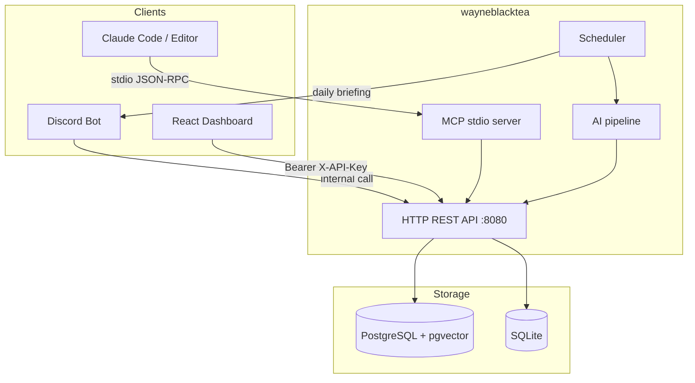

<p align="center">
  
</p>

<p align="center">
  <strong>English</strong> &nbsp;·&nbsp; <a href="./README.zh-TW.md"><strong>繁體中文</strong></a>
</p>

<p align="center">
  <a href="./LICENSE"></a>
</p>

<p align="center">
  A personal-OS server for AI agents — your goals, decisions, knowledge,
  and learning live in one shared brain so the AI you work with already
  knows your context instead of asking you to re-explain it every
  conversation.
</p>

---

## Why this exists

Most AI workflows are stateless. Every chat starts from zero, every agent is amnesiac, and you spend the day re-pasting links and explaining yesterday's context. wayneblacktea takes the opposite position: model your work as **structured data** and let every agent read and write the same store. You stop being the clipboard.

## Features

| Context | What it tracks |
|---------|---------------|
| **GTD** | Goals, projects, tasks with importance and activity log |
| **Decisions** | Architectural choices with rationale and alternatives, queryable by repo |
| **Knowledge** | Articles, TILs, bookmarks, Zettelkasten notes -- full-text and semantic search |
| **Learning** | Spaced-repetition concept cards on an FSRS schedule |
| **Sessions** | Cross-session handoff notes -- "what to continue next time" |
| **Proposals** | Agent-originated entities awaiting user confirmation before materialising |
| **Workspace** | Tracked Git repos with status, known issues, and next planned step |

- **Editor, Discord, and dashboard stay in sync.** Save a link in Discord; see it on the dashboard immediately.
- **Decisions are queryable.** Six weeks later "why did I do X this way" returns a real answer.
- **Agent proposals stay proposals.** Anything with permanent consequences waits for your confirmation.
- **Anti-amnesia signals.** The server tracks tool-call patterns and surfaces stuck tasks, piled-up proposals, and forgotten decisions at session start.

## Architecture

See [`docs/architecture.md`](./docs/architecture.md) for the full data-flow diagram.



## Tech stack

| Item | Technology |
|------|-----------|
| Language | Go 1.26 |
| HTTP framework | Echo |
| Frontend | React 19 + TypeScript 5.9 + Vite 7 |
| Database | PostgreSQL 14+ with pgvector (default) / SQLite (local) |
| MCP transport | stdio (Model Context Protocol) |
| Deployment | Docker / Railway |

## Project structure

```
wayneblacktea/
├── cmd/
│   ├── server/     HTTP API server + embedded dashboard
│   ├── mcp/        MCP stdio server (wired into .mcp.json)
│   ├── wbt/        One-click installer CLI (wbt init / wbt serve)
│   └── doctor/     Health snapshot binary used by editor Stop hook
├── internal/       All business logic (unexported)
├── web/            React dashboard source (built and embedded in server binary)
├── migrations/     SQL migration files, applied in order
├── build/          Dockerfile + Taskfile (quality gate: task check)
└── docs/           Architecture, install guide, operations runbook
```

## Quick install

Three modes -- choose one. Full details in [`docs/install.md`](./docs/install.md).

### SQLite (zero infra, local only)

```bash
git clone https://github.com/Wayne997035/wayneblacktea.git
cd wayneblacktea
go run ./cmd/wbt init        # wizard: picks SQLite, writes .env + .mcp.json
go run ./cmd/wbt serve       # starts server on http://localhost:8080
```

### PostgreSQL

```bash
git clone https://github.com/Wayne997035/wayneblacktea.git
cd wayneblacktea
go run ./cmd/wbt init        # wizard: picks Postgres, prompts for DSN
go run ./cmd/wbt serve
```

### Docker

```bash
git clone https://github.com/Wayne997035/wayneblacktea.git
cd wayneblacktea
cp .env.example .env         # fill in API_KEY, DATABASE_URL
docker build \
  --build-arg VITE_API_KEY=$(grep API_KEY .env | cut -d= -f2) \
  -f build/Dockerfile -t wayneblacktea .
docker run -p 8080:8080 --env-file .env wayneblacktea
```

## 5-minute onboarding

After `wbt init` and `wbt serve`:

**Step 1 -- Open Claude Code and load the MCP server**

`wbt init` writes `.mcp.json` in the project root. Open Claude Code in that directory; it picks up the MCP server automatically.

**Step 2 -- Start your first session**

Ask Claude Code to call `get_today_context`. It returns your active goals, projects, weekly progress, and any pending handoff from a previous session.

**Step 3 -- Do real work**

```
You:   Add a task to finish the landing page copy by Friday, priority 4.
Agent: [calls add_task] Done -- task created under project "marketing-site".

You:   That task is done, PR is merged.
Agent: [calls complete_task] Marked complete, artifact URL recorded.

You:   Why did we choose SQLite over Postgres for local dev?
Agent: [calls list_decisions] Decision logged 2026-04-30: ...
```

**Step 4 -- View the dashboard**

Open `http://localhost:8080` to see the Control Room dashboard: active projects, weekly task progress, pending session handoff, and the decision timeline.

**Step 5 -- End of session**

Tell Claude Code "end session" or "see you tomorrow". It calls `set_session_handoff` so the next session starts from where you left off.

## MCP tools

The MCP server exposes tools across seven domains.

**Session and context**

| Tool | Purpose |
|------|---------|
| `initial_instructions` | Returns the full usage protocol -- call at session start |
| `get_today_context` | Active goals, projects, weekly progress, pending handoff |
| `set_session_handoff` | Record what to continue next session |
| `resolve_handoff` | Mark the pending handoff resolved when work resumes |
| `system_health` | Snapshot: stuck tasks, pending proposals, anti-amnesia signals |

**GTD**

| Tool | Purpose |
|------|---------|
| `list_goals` | All active goals ordered by due date |
| `create_goal` | Create a new goal directly |
| `list_projects` | All active projects |
| `get_project` | Project detail with recent decisions |
| `create_project` | Create a new project directly |
| `update_project_status` | Move project between active / on_hold / completed / archived |
| `list_tasks` | Tasks, optionally filtered by project |
| `add_task` | Create a task under a project |
| `update_task` | Change task status |
| `complete_task` | Mark task done and record artifact URL |
| `delete_task` | Permanently remove a task |
| `log_activity` | Record an activity log entry for a project |
| `confirm_plan` | Atomically create tasks + log decisions when user confirms a plan |

**Decisions**

| Tool | Purpose |
|------|---------|
| `log_decision` | Record an architectural or design decision |
| `list_decisions` | Query decisions by repo or project |

**Knowledge**

| Tool | Purpose |
|------|---------|
| `add_knowledge` | Save an article, TIL, bookmark, or Zettelkasten note |
| `search_knowledge` | Full-text and semantic search across saved items |
| `list_knowledge` | Paginated list of knowledge items |
| `sync_to_notion` | Push a knowledge item to the configured Notion database |

**Learning**

| Tool | Purpose |
|------|---------|
| `create_concept` | Create a concept card with FSRS review schedule |
| `get_due_reviews` | All concepts currently due for review |
| `submit_review` | Rate a review and update the next schedule |

**Proposals**

| Tool | Purpose |
|------|---------|
| `propose_goal` | Suggest a new goal for user confirmation |
| `propose_project` | Suggest a new project for user confirmation |
| `list_pending_proposals` | Show proposals awaiting resolution |
| `confirm_proposal` | Accept (materialise) or reject a pending proposal |

**Workspace and architecture**

| Tool | Purpose |
|------|---------|
| `list_active_repos` | All active repositories in the workspace |
| `sync_repo` | Create or update a repository entry |
| `upsert_project_arch` | Store an architecture snapshot for a project |
| `get_project_arch` | Retrieve a stored architecture snapshot |

## Environment variables

`wbt init` writes these automatically. Manual reference:

| Variable | Required | Purpose |
|----------|----------|---------|
| `API_KEY` | Yes | Bearer token for every `/api/*` request |
| `DATABASE_URL` | Postgres only | PostgreSQL connection string |
| `STORAGE_BACKEND` | No | `postgres` (default) or `sqlite` |
| `SQLITE_PATH` | SQLite only | Path to the SQLite database file |
| `ALLOWED_ORIGINS` | No | Comma-separated CORS origins |
| `PORT` | No | HTTP port (default `8080`) |
| `WORKSPACE_ID` | No | UUID for workspace scoping; unset for single-user mode |
| `USER_ID` | No | Identity tag for agent-originated writes |
| `CLAUDE_API_KEY` | No | Enables AI summarisation and activity classification |
| `GEMINI_API_KEY` | No | Enables vector embeddings for knowledge dedup and similarity search |
| `GROQ_API_KEY` | No | Powers the Discord bot LLM analyser |
| `DISCORD_BOT_TOKEN` | No | Discord bot session token; bot is disabled when unset |
| `DISCORD_GUILD_ID` | No | Discord guild for slash command registration |
| `DISCORD_WEBHOOK_URL` | No | Outbound webhook for scheduled briefing posts |
| `NOTION_INTEGRATION_SECRET` | No | Enables the `sync_to_notion` tool |
| `NOTION_DATABASE_ID` | No | Target Notion database for synced pages |
| `POSTGRES_INSECURE_TLS` | No | Set `true` for managed Postgres providers (Railway, Aiven) |

Security note: never commit `.env`. API keys must be injected via environment variables in production.

## Development

### Prerequisites

| Tool | Minimum version |
|------|----------------|
| Go | 1.26 |
| Node.js | 22 |
| Task | latest stable |
| PostgreSQL + pgvector | 14+ |

### Local run

```bash
cp .env.example .env   # fill in DATABASE_URL, API_KEY
cd web && npm ci && npm run build && cd ..
cd build && task build-server && cd ..
./bin/wayneblacktea-server -env .env
```

### Quality gate

```bash
cd build && task check   # lint + tests + build all binaries; must be 0 issues
```

## CI/CD

```
Push to any branch  -->  lint + test + build
Merge to main       -->  lint + test + build + Docker build + deploy to Railway
Git tag (vX.Y.Z)    -->  GoReleaser cross-compile + GitHub Release
```

## Deployment

Production deployment is a single Railway service built from `build/Dockerfile`.

```bash
railway link --service <your-service-name>
railway up --ci -m "your deploy message"
```

Healthcheck endpoint: `GET /health`

---

Day-by-day changes: [CHANGELOG.md](./CHANGELOG.md)
Full self-hosting reference: [docs/install.md](./docs/install.md)
Architecture deep-dive: [docs/architecture.md](./docs/architecture.md)

Released under [MIT](./LICENSE).
