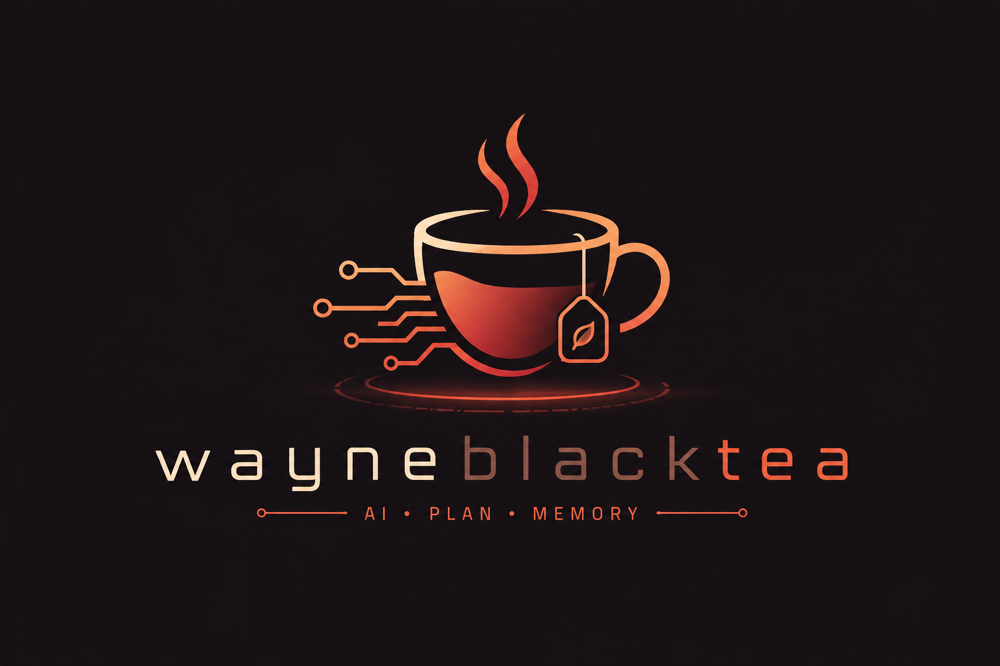

<p align="center">
  
</p>

<p align="center">
  <strong>English</strong> &nbsp;·&nbsp; <a href="./README.zh-TW.md"><strong>繁體中文</strong></a>
</p>

<p align="center">
  <a href="./LICENSE"></a>
</p>

<p align="center">
  A personal-OS MCP server for AI agents — your goals, decisions, knowledge,
  and learning live in one shared brain so the AI you work with already
  knows your context instead of asking you to re-explain it every conversation.
</p>

---

## Install

```bash
go install github.com/Wayne997035/wayneblacktea/cmd/wbt@latest
wbt setup
```

That's it. `wbt setup` does end-to-end: creates the SQLite store, reclaims the TCP port if something's squatting on it, spawns `wayneblacktea-server` in the background (PID file under `$XDG_STATE_HOME/wayneblacktea/`), waits for `/health`, and registers the HTTP MCP transport with Claude Code:

```
$ wbt setup
==> Reading or creating config…          [ok] Config ready
==> Ensuring SQLite directory…           [ok] SQLite directory ready
==> Resolving port…                      [ok] Port resolved: 8420
==> Checking for an existing healthy server…
==> Reclaiming TCP port if occupied…     [ok] Port is free
==> Spawning wayneblacktea-server in the background…
                                         [ok] Server spawned (pid 12345, logs ~/.local/state/wayneblacktea/server.log)
==> Waiting for /health…                 [ok] Server is healthy
==> Registering MCP with Claude Code…    [ok] claude mcp add wayneblacktea --transport http http://127.0.0.1:8420/mcp
All set. wayneblacktea is running at http://127.0.0.1:8420
```

Verify the install:

```bash
wbt status                      # shows pid / port / health
claude mcp get wayneblacktea    # should show ✔ Connected
```

Open Claude Code from any directory — no `.mcp.json` needed.

Sister commands:

| Command | What it does |
|---------|--------------|
| `wbt status [--format json\|plain]` | Report whether the background server is running and healthy |
| `wbt stop` | Terminate the background server (idempotent) |
| `wbt restart` | `stop` then `setup` |
| `wbt setup --port 9090` | Use a non-default port |
| `wbt setup --no-mcp` | Skip the `claude mcp add` step |
| `wbt init` | Deprecated alias for `wbt setup` |

### Install channels

| Channel | Command | Best for |
|---------|---------|----------|
| go install | `go install github.com/Wayne997035/wayneblacktea/cmd/wbt@latest && wbt setup` | Go 1.26+ installed — recommended |
| Build from source | `git clone ... && cd build && task build-wbt && wbt setup` | Developers; see [`docs/install.md`](./docs/install.md) |
| Run the server directly | `npm run build && go run ./cmd/server -env .env` | Hacking on the server or the web UI — see [`docs/quickstart.md`](./docs/quickstart.md) for the port, the three auth rules, and why `curl` succeeding does not mean the browser can log in |

See [`docs/install.md`](./docs/install.md) for Postgres, Docker, Railway, and [Troubleshooting](./docs/install.md#troubleshooting).

## 5-minute onboarding

Once `wbt setup` finishes, open Claude Code from any directory and try:

```
# See what the server already remembers
> get_today_context

# Log a decision (stored permanently, queryable by repo)
> log_decision "Chose SQLite because..."

# Add a task
> add_task "Implement login flow" --project my-project

# Atomically confirm a multi-step plan (tasks+decisions; work_session is separate best-effort)
> confirm_plan {phases: [...], decisions: [...]}

# Save a knowledge note (keyword + semantic vector search)
> add_knowledge {title: "JWT expiry best practices", content: "..."}

# Record an idea that isn't actionable yet
> add_vision_item {title: "Multi-agent collaboration protocol", why_blocked: "waiting on the E1 provider interface"}
```

Full tool reference: [`docs/mcp-tools.md`](./docs/mcp-tools.md).

## Architecture

```mermaid
flowchart TD
    CC["Claude Code\n(wbt mcp — stdio)"]
    CURL["HTTP clients\n(dashboard / curl)"]
    HTTPMCP["HTTP MCP transport\n(/mcp)"]

    CC   -->|MCP stdio|       SRV
    CURL -->|REST /api/star|  SRV
    HTTPMCP -->|MCP over HTTP| SRV

    SRV["wayneblacktea-server\n(Echo HTTP + mcp-go)"]

    SRV --> STORES["Store interfaces\ngtd · decision · knowledge · session\nproposal · vision · learning · workspace"]

    STORES --> SQLITE["SQLite\n(local dev, zero infra)"]
    STORES --> PG["Postgres + pgvector\n(Aiven / Railway)"]

    SRV --> AI["AI providers\nAnthropic · Gemini embeddings\nGroq (Discord bot)"]
    SRV --> SCHED["Scheduler\nSaturday reflection\nauto-consolidation · decay prune"]
    SRV --> DISCORD["Discord bot"]
```

One process serves MCP stdio, HTTP REST, and HTTP MCP — no separate components to run.

## What you get

Once Claude Code is connected to `wbt mcp`, every MCP-capable agent reads and writes the same store:

| Context | What it tracks |
|---------|---------------|
| **GTD** | Goals → projects → tasks with importance, activity log |
| **Decisions** | Architectural choices with rationale + alternatives, queryable by repo |
| **Knowledge** | Articles, TILs, bookmarks, notes — full-text + pgvector semantic search; Markdown headings fan-out into searchable child nodes |
| **Learning** | Spaced-repetition concept cards on an FSRS schedule, auto-proposed from new knowledge |
| **Sessions** | Cross-session handoff notes — "what to continue next time" |
| **Proposals** | Agent-originated entities awaiting your confirmation before they materialise |
| **Vision** | Deferred ideas that aren't ready to be tasks yet — `open → discussing → maturing → promoted → dismissed` |
| **Workspace** | Tracked Git repos with status, known issues, next planned step |

## Auto-memory (no nagging required)

The agent doesn't need to remember to save things. The server captures them automatically:

- **MCP middleware classifier** — every significant tool call (`complete_task`, `confirm_proposal`, `upsert_project_arch`, `update_project_status`, `resolve_handoff`, `sync_repo`) is async-classified by Haiku; implicit decisions get auto-logged, follow-up tasks get auto-created. Rate-capped at 60/min, deduped, prompt-injection-bounded.
- **Stop hook** (`wbt-doctor`) — when a Claude Code session ends, the transcript is compressed to a ≤500-char summary and stored as both `session_handoffs.summary_text` and a searchable `knowledge_items` row.
- **SessionStart hook** (`wbt-context`) — the next session opens with the previous handoff, recent decisions, and due reviews already injected as context.
- **Saturday reflection cron** — weekly batch reads 7 days of activity + decisions and proposes 3-5 retrospective knowledge entries (gated through `pending_proposals` for your confirmation).
- **Auto-consolidation** — clusters of ≥5 same-actor activities in the last 30 days get merged into a single proposed knowledge entry.

## Design

**Structure beats prompts.** Encode what you want the AI to remember as an explicit schema. No drift between agents, no "I think you mentioned…" — it's just data.

**You stay in control.** Agents propose, you confirm. The friction is the point — a system that decides for you eventually decides everything.

**Make forgetting visible.** The server tracks every tool call and surfaces forgotten work — stuck `in_progress` tasks, piled-up proposals, decisions logged without a session-start recall.

**Workflow tools, not raw CRUD.** The agent surface exposes verbs like "get today's context", "confirm this plan", "log this decision" — rules live in the tool layer, not scattered across each client's prompt.

## vs similar tools

| | wayneblacktea | claude-mem | Hermes Agent Memory |
|---|---|---|---|
| **Scope** | Full personal OS (GTD + decisions + knowledge + learning + vision) | Conversation memory only | Conversation + entity memory |
| **Storage** | SQLite (local) or Postgres+pgvector (cloud) | Managed cloud | Managed cloud |
| **Control** | Self-hosted, you own the data | Third-party | Third-party |
| **Proposals gate** | Agent proposes → you confirm | None | None |
| **Spaced repetition** | FSRS learning cards | None | None |
| **Dashboard** | Web UI + Discord bot | None | None |
| **Tradeoff** | More setup, more surface area | Zero setup | Zero setup |

## Checking what's running

Read the `wayneblacktea://system/build-info` MCP resource (or `GET /health`
for a bare liveness check) to see exactly which build is running. Two
fields matter:

- `version` and `build_id` **carry different values on purpose** — they
  answer different questions:
  - **`version` — which release?** Reads `buildinfo.EffectiveVersion()`,
    which is also what the MCP handshake's `serverInfo.version` reports.
  - **`build_id` — which build exactly?** Reads `buildinfo.FullBuildID()`:
    `<commit>@<RFC3339 build time>`, with the commit **verbatim** rather than
    truncated, so it can be handed straight to `git show`. `version`
    truncates to 12 hex because it has to stay sortable; that prefix is
    readable but not enough to identify an object with certainty.

  They were briefly identical, which made `build_id` carry nothing `version`
  did not already say. What the original defect required was only that
  `version` never report the raw `"dev"` sentinel for a build that knows its
  own commit — the equality was a side effect of the first fix, not the goal.
- `version` is the release tag when the binary carries one. There are two ways
  it can: `go install …@v1.0.0` bakes the module version into the build info,
  and `build/Dockerfile` can inject one through `-ldflags`. Otherwise —
  including every Railway production deploy, which builds from a branch rather
  than a tag — it is a synthetic,
  Go-pseudo-version-shaped identifier: `v0.0.0-<build-time-yyyymmddhhmmss>-<commit-sha12>`,
  derived from the build's commit SHA and build timestamp (`build/Dockerfile`
  reads these from Railway's `RAILWAY_GIT_COMMIT_SHA` build arg). **The
  timestamp is BUILD time, not COMMIT time** — it is captured when the Docker
  image is built, not when the commit was authored, so it will differ from
  the pseudo-version string `go list -m` would compute for the same commit
  (measured drift on this repo: ~20 seconds). Treat it as "which build
  produced this response," not as a stand-in for a real Go module
  pseudo-version.
- **`"dev"` means the binary has no injected build identity** — a plain
  `go build` or `go test`, or a container build where
  `RAILWAY_GIT_COMMIT_SHA` never reached `build/Dockerfile`. The `-ldflags`
  injection always runs; without that arg it injects the `none` default that
  `COMMIT` carries, and `BuildID()` returns the sentinel rather than deriving
  an identifier from it. (A *malformed* — non-hex — value is a different
  path: the build fails closed, `build/Dockerfile:74-77`. A blocked deploy is
  loud; a forged build identity would be silent.) The sentinel is
  deliberately not version-shaped so an identity-less build can never be
  mistaken for a real one. **A Railway deploy reporting `"dev"` is a defect,
  not the expected state** — either the build arg was dropped, or the
  resource is not reading `buildinfo.EffectiveVersion()`. The second of those
  shipped once, and readers who looked only at this field concluded from it
  that production was running stale code.

## Verifying what you installed

There is no separate verify step, because `go install` already does it. Every module the
toolchain fetches is checked against its `h1:` hash in the
[Go checksum database](https://sum.golang.org), fail-closed — a tampered or substituted module
makes the install fail. That is the guarantee cosign signing was there to provide, except it
holds without anyone remembering to run a verify command.

To see what a binary actually is:

```bash
go version -m $(command -v wbt)
```

The `mod` line carries the module path, the version, and the `h1:` sum. `wbt version` reads the
same build info, so a proxy-installed binary reports its real version with no link-time injection.

## What this *isn't*

- **Not a team product.** One person, many agents. No RBAC, no shared workspace, no Notion-clone collaboration.
- **Not a hosted service.** Self-host on your own machine. Workspace scoping is for personal data isolation, not multi-tenancy.
- **Not a stable API.** Solo project, irregular releases, breaking changes happen, dashboard rough edges remain.
- **Not a chatbot with memory.** The schema is the memory. Conversation history is irrelevant.

---

Licensed under [MIT](./LICENSE). Architecture deep-dive in [`docs/architecture.md`](./docs/architecture.md).
