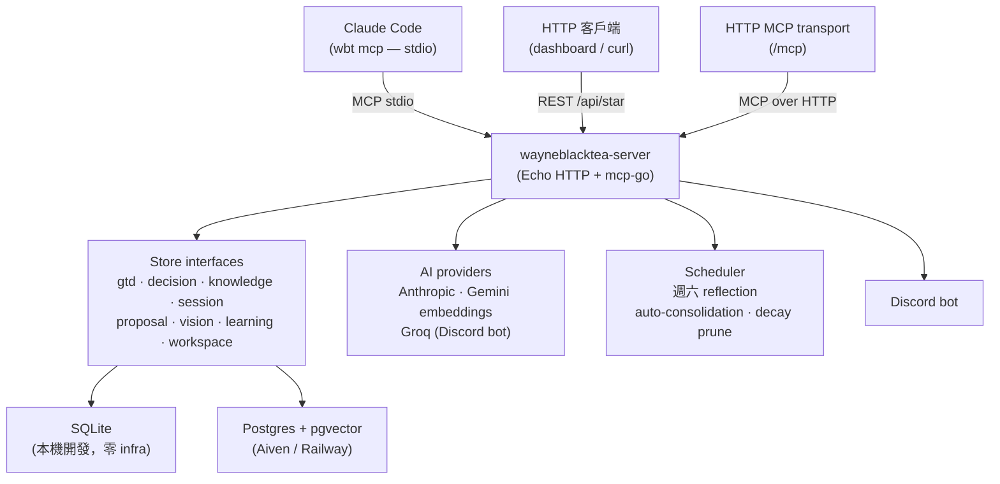

<p align="center">
  
</p>

<p align="center">
  <a href="./README.md"><strong>English</strong></a> &nbsp;·&nbsp; <strong>繁體中文</strong>
</p>

<p align="center">
  <a href="./LICENSE"></a>
</p>

<p align="center">
  一個給 AI agent 的 personal-OS MCP server — 你的目標、決策、知識、學習
  全都活在同一顆共用的腦裡，讓你合作的 AI 已經知道你的脈絡，而不是
  每次對話都要從零解釋一次。
</p>

---

## 安裝

前置需求：Go **1.26.4+**（版本以 [`go.mod`](./go.mod) 的 `go` 指令為準，這個數字若看起來過期以該檔為準）、Node.js 22+、[Task](https://taskfile.dev/)（`go install github.com/go-task/task/v3/cmd/task@latest`）。

`wbt` 跟 `wayneblacktea-server` 要從同一份 clone 建出來。`go install .../cmd/wbt@latest` 會從 Go module proxy 解到最新的 release tag —— 混著用本機 clone 建出來的 server（不管你 clone 到哪個 commit），會讓你手上兩支 binary 是不同版本，而且不會有任何警告：

```bash
git clone https://github.com/Wayne997035/wayneblacktea.git
cd wayneblacktea
cd build && task build-frontend && task build-server && task build-wbt   # build-frontend 把 web/dist 複製進 cmd/server/web/dist，cmd/server 的 go:embed 需要它
install -m 0755 ../bin/wbt ../bin/wayneblacktea-server ~/.local/bin/
wbt setup
```

確認 `~/.local/bin` 在你的 `PATH` 上——不在的話,把它加進 shell 設定,或改 `install` 到一個已經在 `PATH` 上的目錄。

`wbt setup` 一條龍：建立 SQLite 目錄、解析 port、佔用就 reclaim、用 `nohup` 在背景啟動 `wayneblacktea-server`（PID file 寫到 `$XDG_STATE_HOME/wayneblacktea/`）、輪詢 `/health`，最後用 `claude mcp add --transport http` 把 HTTP MCP 註冊到 Claude Code。

```
$ wbt setup
==> Reading or creating config…          [ok] Config ready
==> Ensuring SQLite directory…           [ok] SQLite directory ready
==> Resolving port…                      [ok] Port resolved: 8420
==> Checking for an existing healthy server…
==> Reclaiming TCP port if occupied…     [ok] Port is free
==> Spawning wayneblacktea-server in the background…
                                         [ok] Server spawned (pid 12345, logs ~/.local/state/wayneblacktea/server.log)
==> Waiting for /health…                 [ok] Server is healthy
==> Registering MCP with Claude Code…    [ok] claude mcp add wayneblacktea --transport http http://127.0.0.1:8420/mcp
All set. wayneblacktea is running at http://127.0.0.1:8420
```

安裝完成後驗證：

```bash
wbt status                      # 顯示 pid / port / 健康狀態
claude mcp get wayneblacktea    # 應顯示 ✔ Connected
```

從任何目錄開 Claude Code 即可使用，不用 `.mcp.json`。

姊妹指令：

| 指令 | 用途 |
|------|------|
| `wbt status [--format json\|plain]` | 看背景 server 有沒有跑、健康狀態 |
| `wbt stop` | 停掉背景 server（idempotent，沒跑會回報 not running） |
| `wbt restart` | `stop` + `setup` |
| `wbt setup --port 9090` | 用非預設 port |
| `wbt setup --no-mcp` | 跳過 `claude mcp add` 步驟 |
| `wbt init` | `wbt setup` 的 deprecated alias |

核心 MCP 記憶功能不需要 Anthropic API key。Postgres、Docker、Railway 部署方式見 [`docs/install.md`](./docs/install.md)，常見問題見 [Troubleshooting](./docs/install.md#troubleshooting)。

### 其他跑法

| 管道 | 指令 | 適合 |
|------|------|------|
| 直接跑 server | `cd build && task build-frontend && cd .. && go run ./cmd/server -env .env` | 想改 server 或 web UI 的人 — port、三條路線的認證規則、以及為什麼 `curl` 通不代表瀏覽器登得進去，見 [`docs/quickstart.md`](./docs/quickstart.md) |

## 5 分鐘 onboarding

`wbt setup` 完成後，從任何目錄開 Claude Code，試試：

```
# 看看 server 現在記得什麼
> get_today_context

# 記錄一個決策（永久儲存，可依 repo 查詢）
> log_decision "選 SQLite 是因為..."

# 加任務
> add_task "實作登入流程" --project my-project

# 原子確認多步計畫(任務＋決策同一交易;work_session 另為 best-effort)
> confirm_plan {phases: [...], decisions: [...]}

# 加一條知識筆記（支援關鍵字 + semantic vector 搜尋）
> add_knowledge {title: "JWT 過期最佳實踐", content: "..."}

# 記錄現在還不能做的想法
> add_vision_item {title: "多 agent 協作協定", why_blocked: "要等 E1 provider interface 完成"}
```

完整工具列表：[`docs/mcp-tools.md`](./docs/mcp-tools.md)。

## 架構



同一個 process 同時服務 MCP stdio、HTTP REST、HTTP MCP — 不用跑多個元件。

## 你會得到

Claude Code 連上 `wbt mcp` 後，所有支援 MCP 的 agent 都讀寫同一份儲存：

| Context | 擁有什麼 |
|---------|---------|
| **GTD** | 目標 → 專案 → 任務（含重要性與討論脈絡），加 activity log |
| **Decisions** | 架構與設計決策，含理由與替代方案，可依 repo 查詢 |
| **Knowledge** | 文章、TIL、書籤、筆記 — 全文與 pgvector 語意搜尋；Markdown heading 自動 fan-out 成可獨立搜尋的子節點 |
| **Learning** | 間隔重複概念卡，跑 FSRS 排程，可從新存的知識自動提案 |
| **Sessions** | 跨 session 的交接筆記 — 「下次要繼續什麼」 |
| **Proposals** | Agent 原創、等使用者確認的物件 |
| **Vision** | 還沒準備好成為 task 的想法 — `open → discussing → maturing → promoted → dismissed` |
| **Workspace** | 追蹤的 Git repo，含狀態、已知問題、下一步計畫 |

## 自動記憶（不用你提醒）

Agent 不需要記得呼叫工具，server 會自動接住：

- **MCP middleware classifier** — 任何 significant tool 呼叫（`complete_task`、`confirm_proposal`、`upsert_project_arch`、`update_project_status`、`resolve_handoff`、`sync_repo`）執行成功後丟給 Haiku 非同步分類；隱性決策自動 log_decision、隱性任務自動 add_task。每分鐘 60 次 rate cap、dedup、prompt injection boundary。
- **Stop hook**（`wbt-doctor`）— Claude Code session 結束時 transcript 壓成 ≤500 字 summary，同時寫進 `session_handoffs.summary_text` 跟可搜尋的 `knowledge_items`。
- **SessionStart hook**（`wbt-context`）— 下次 session 開啟時自動把上次 handoff、最近決策、今天 due reviews 注入成 context。
- **Saturday reflection cron** — 週六批次掃 7 天 activity_log + decisions，叫 Haiku 起草 3-5 條 retrospective knowledge，走 `pending_proposals` 等你確認。
- **Auto-consolidation** — 同 actor 30 天內 ≥5 條相關 activity 被合併成一條 knowledge proposal。

## 設計哲學

**結構優先於 prompt。** 把你想要 AI 記得的部分編碼成明確 schema。Agent 之間沒漂移、沒有「我記得你提過…」，就是資料。

**使用者保留決定權。** Agent 提案，你確認。摩擦本身就是重點 — 一個替你做決定的系統最後會讓你不會做決定。

**讓遺忘可見。** 再自律的 agent 都會忘記收尾。Server 把每次工具呼叫都記下來，把模式講出來 — 卡住的 in-progress 任務、累積的 pending 提案、登錄了決策卻沒做 session 開頭 recall。

**Workflow 工具，不是原始 CRUD。** Agent 接觸面提供「拿今天的 context」、「確認一個計畫」、「登錄一個決策」這種動詞操作。規則住在工具層，而不是散落在每個 client 的 prompt 裡。

## 與類似工具比較

| | wayneblacktea | claude-mem | Hermes Agent Memory |
|---|---|---|---|
| **範圍** | 完整 personal OS（GTD + 決策 + 知識 + 學習 + 願景） | 對話記憶 | 對話 + entity 記憶 |
| **儲存** | SQLite（本機）或 Postgres+pgvector（雲端） | 託管雲端 | 託管雲端 |
| **掌控** | Self-hosted，資料自有 | 第三方 | 第三方 |
| **提案閘門** | Agent 提案 → 使用者確認 | 無 | 無 |
| **間隔重複** | FSRS 學習卡 | 無 | 無 |
| **儀表板** | Web UI + Discord bot | 無 | 無 |
| **取捨** | 設定較多，功能面更廣 | 零設定 | 零設定 |

## 驗證 release binary

`go install` 本身就驗過了。工具鏈抓的每一個模組都會對照 [Go checksum database](https://sum.golang.org) 的 `h1:` 雜湊檢查,fail-closed —— 被竄改或替換的模組會讓安裝失敗,沒有旗標可以略過。那正是 cosign 簽章原本要提供的保證,差別在於它不需要任何人記得跑驗證指令。

要看一個 binary 到底是什麼:

```bash
go version -m $(command -v wbt)
```

`mod` 那行有模組路徑、版本與 `h1:` 雜湊。`wbt version` 讀同一份 build info,所以用 proxy 裝的 binary 不需要任何 link-time 注入就報得出真版本。

## 這 *不是* 什麼

- **不是團隊產品。** 一個人，多個 agent。沒有 RBAC，沒有共享 workspace，沒有 Notion-clone 協作。
- **不是 hosted 服務。** Self-host 在你自己機器上。Workspace scope 只是幫你資料隔離，不是多租戶。
- **不是穩定 API。** 一個人開發跟維運。release 不規律、會有 breaking change、儀表板還有粗糙的角落。
- **不是有記憶的 chatbot。** Schema 才是記憶，對話歷史不重要。

---

採用 [MIT](./LICENSE) 授權。架構細節在 [`docs/architecture.md`](./docs/architecture.md)。
