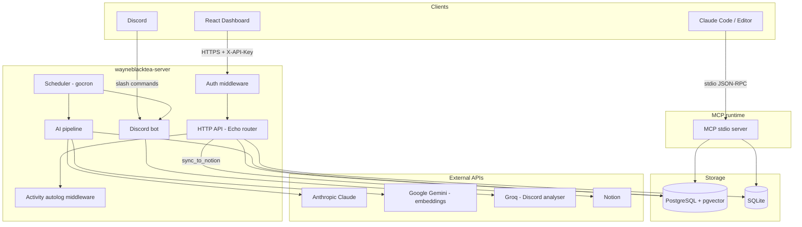
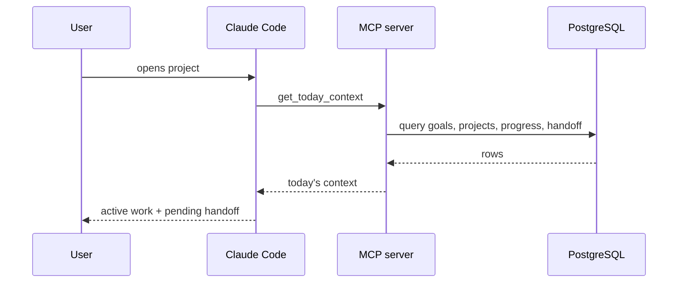
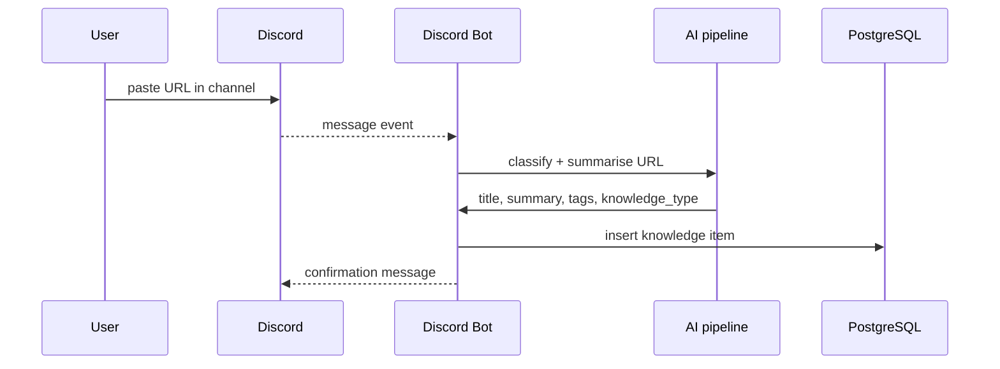

# wayneblacktea -- Architecture

This document describes the system's components and how data flows between them.

## Overview

wayneblacktea runs as three binaries from a single Go module:

| Binary | Role |
|--------|------|
| `wayneblacktea-server` | HTTP REST API + embedded React dashboard + Discord bot + background scheduler |
| `wayneblacktea-mcp` | Standalone MCP stdio server for systemd / Docker deployments |
| `wbt` | One-click installer CLI (`wbt init` / `wbt serve` / `wbt mcp`) |

A fourth binary, `wbt-doctor`, is a one-shot health snapshot tool invoked by the editor Stop hook.

## Component diagram

## Data flow: session start

## Data flow: knowledge save via Discord

## Activity auto-classify pipeline

Every write request through the HTTP API passes through two middleware layers:

1. **Autolog middleware** -- records each tool call to the activity log, keyed by actor (`claude-code`, `human`, etc.).
2. **Classify middleware** -- runs an async AI classifier that detects task intent in free-text fields and proposes tasks if a pattern is found.

Both layers are non-blocking: the HTTP response is not held while classification runs.

## Storage backends

| Backend | When to use | Notes |
|---------|-------------|-------|
| PostgreSQL + pgvector | Production, full feature set | Required for semantic search and vector dedup |
| SQLite | Local development, zero infra | No vector search; knowledge dedup falls back to URL-only |

The backend is selected at startup via `STORAGE_BACKEND`. All domain stores implement the same interface, so the rest of the codebase is backend-agnostic.

## Bounded contexts

Seven bounded contexts; each owns its schema tables and service layer. They share a workspace scope predicate but do not reach into each other's stores directly.

| Context | Key tables | Operations |
|---------|-----------|-----------|
| GTD | `goals`, `projects`, `tasks`, `activity_log` | Goals > Projects > Tasks hierarchy |
| Decisions | `decisions` | Log + query by repo or project |
| Knowledge | `knowledge_items` | Save, dedup, full-text + semantic search, Notion sync |
| Learning | `concepts`, `review_schedules` | FSRS spaced-repetition scheduling |
| Sessions | `session_handoffs` | Cross-session continuity |
| Proposals | `proposals` | Agent-originated pending entities |
| Workspace | `repos`, `project_arch` | Repo state, architecture snapshots |

## Scheduler jobs

| Job | Frequency | What it does |
|-----|-----------|-------------|
| Daily briefing | Daily | Posts active tasks and pending handoffs to Discord webhook |
| Weekly AI concept review | Weekly | Claude reviews low-retention concepts and proposes archival or reinforcement |
| Anti-amnesia watchdog | Periodic | Detects stuck in-progress tasks and piled-up proposals |

## MCP server wiring

`wbt mcp` is the end-user MCP stdio entry point. The standalone `wayneblacktea-mcp` binary is kept for systemd / Docker-style deployments; both call the same `internal/mcprunner.Run` wiring.

`wbt init` writes `.mcp.json` automatically, pointing `command` at `wbt` with `args: ["mcp"]` and injecting only the storage environment. Provider keys stay in `.env` / process environment when present. The init wizard is memory-only; optional AI integrations are enabled later by editing `.env`.

## Dashboard

The React dashboard (`web/`) is built once at compile time and embedded into the `wayneblacktea-server` binary via `//go:embed`. It is served at `GET /` by the same Echo process that handles the API.

Tech: React 19, TypeScript 5.9, Vite 7, TanStack Query, Zustand, Tailwind CSS v4, Lucide React.
