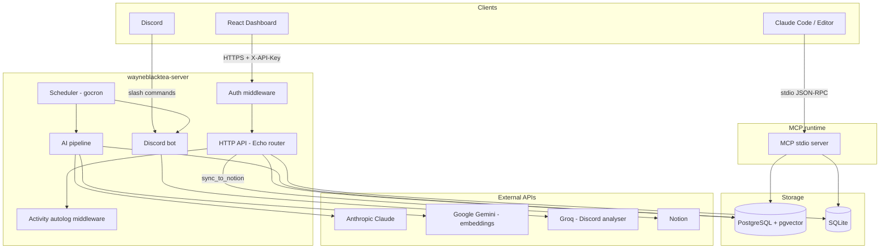
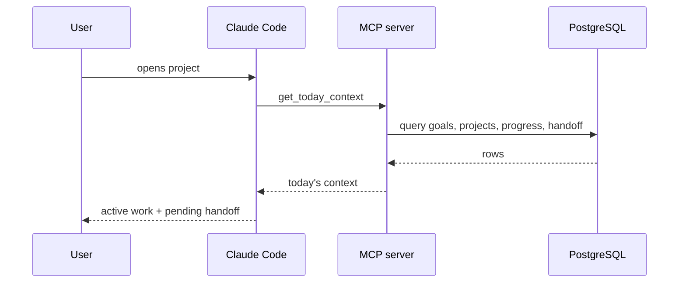
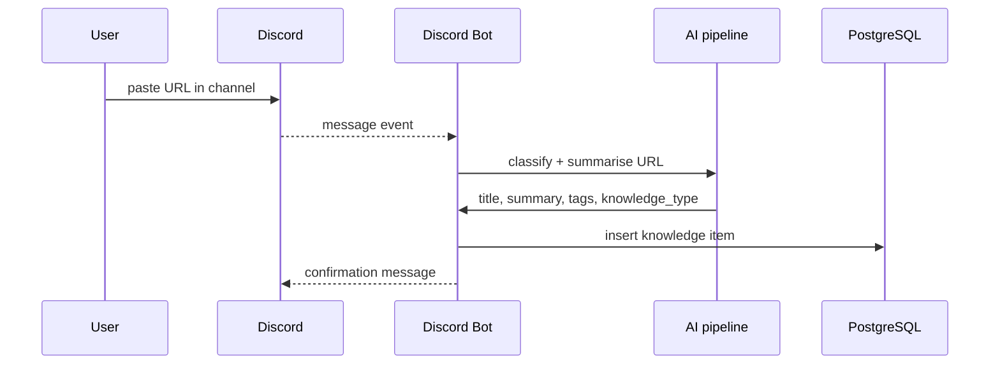

# wayneblacktea -- Architecture

This document describes the system's components and how data flows between them.

## Overview

wayneblacktea runs as three binaries from a single Go module:

| Binary | Role |
|--------|------|
| `wayneblacktea-server` | HTTP REST API + embedded React dashboard + Discord bot + background scheduler |
| `wayneblacktea-mcp` | Standalone MCP stdio server for systemd / Docker deployments |
| `wbt` | One-click installer CLI (`wbt init` / `wbt serve` / `wbt mcp`) |

A fourth binary, `wbt-doctor`, is a one-shot health snapshot tool invoked by the editor Stop hook.

## Component diagram

```mermaid
graph TD
    subgraph Clients
        CC[Claude Code / Editor]
        DISC[Discord]
        FE[React Dashboard]
    end

    subgraph wayneblacktea-server
        API[HTTP API - Echo router]
        AUTH[Auth middleware]
        ALOG[Activity autolog middleware]
        SCH[Scheduler - gocron]
        AI[AI pipeline]
        BOT[Discord bot]
    end

    subgraph MCP runtime
        MCP[MCP stdio server]
    end

    subgraph Storage
        PG[(PostgreSQL + pgvector)]
        SQ[(SQLite)]
    end

    subgraph External APIs
        CLAUDE[Anthropic Claude]
        GEMINI[Google Gemini - embeddings]
        GROQ[Groq - Discord analyser]
        NOTION[Notion]
    end

    CC -->|stdio JSON-RPC| MCP
    FE -->|HTTPS + X-API-Key| AUTH
    DISC -->|slash commands| BOT

    MCP --> PG
    MCP --> SQ
    AUTH --> API
    API --> ALOG
    API --> PG
    API --> SQ

    SCH --> AI
    AI --> CLAUDE
    AI --> GEMINI
    AI --> PG

    SCH --> BOT
    BOT --> GROQ

    API -->|sync_to_notion| NOTION
```

## Data flow: session start

```mermaid
sequenceDiagram
    participant User
    participant Editor as Claude Code
    participant MCP as MCP server
    participant DB as PostgreSQL

    User->>Editor: opens project
    Editor->>MCP: get_today_context
    MCP->>DB: query goals, projects, progress, handoff
    DB-->>MCP: rows
    MCP-->>Editor: today's context
    Editor-->>User: active work + pending handoff
```

## Data flow: knowledge save via Discord

```mermaid
sequenceDiagram
    participant User
    participant Discord
    participant Bot as Discord Bot
    participant AI as AI pipeline
    participant DB as PostgreSQL

    User->>Discord: paste URL in channel
    Discord-->>Bot: message event
    Bot->>AI: classify + summarise URL
    AI->>Bot: title, summary, tags, knowledge_type
    Bot->>DB: insert knowledge item
    Bot-->>Discord: confirmation message
```

## Activity auto-classify pipeline

Every write request through the HTTP API passes through two middleware layers:

1. **Autolog middleware** -- records each tool call to the activity log, keyed by actor (`claude-code`, `human`, etc.).
2. **Classify middleware** -- runs an async AI classifier that detects task intent in free-text fields and proposes tasks if a pattern is found.

Both layers are non-blocking: the HTTP response is not held while classification runs.

## Storage backends

| Backend | When to use | Notes |
|---------|-------------|-------|
| PostgreSQL + pgvector | Production, full feature set | Required for semantic search and vector dedup |
| SQLite | Local development, zero infra | No vector search; knowledge dedup falls back to URL-only |

The backend is selected at startup via `STORAGE_BACKEND`. All domain stores implement the same interface, so the rest of the codebase is backend-agnostic.

## Bounded contexts

22 bounded contexts (spanning 24 `internal/*` store-owning packages — `Watchdog / Discipline` bundles three packages into one row, see below); each owns its schema tables and service layer. They share a workspace scope predicate but do not reach into each other's stores directly.

| Context | Key tables | Operations |
|---------|-----------|-----------|
| GTD | `goals`, `projects`, `tasks`, `activity_log` | Goals > Projects > Tasks hierarchy |
| Decisions | `decisions` | Log + query by repo or project |
| Knowledge | `knowledge_items` | Save, dedup, full-text + semantic search, Notion sync |
| Learning | `concepts`, `review_schedule` | FSRS spaced-repetition scheduling |
| Sessions | `session_handoffs` | Cross-session continuity |
| Proposals | `pending_proposals` | Agent-originated pending entities |
| Workspace | `repos`, `workspace_preferences` | Repo state, per-workspace model preference |
| Architecture Snapshots | `project_arch` | Cached architecture summary + file map per repo slug, refreshed after Claude reads 3+ `internal/` files |
| Status Snapshots | `project_status_snapshots` | Weekly project status digest with a 24h cache, force-refreshed by the `saturday-status-snapshot` job |
| Memory Atoms | `memory_atoms`, `memory_links` | Atomic fact units extracted from decisions/knowledge/procedural memories; directed graph via typed links |
| Outcomes & Evaluations | `outcomes`, `evaluations` | Closes the Action→Result loop: `record_outcome` captures what happened, `evaluate_outcome` attaches structured analysis |
| Reflections | `reflections` | Weekly Haiku-generated knowledge proposals summarised from `activity_log` + recent decisions |
| Behavior Rules | `behavior_rules` | AI-derived or manually-authored agent-behavior rules; proposal → active promotion via `apply_behavior_rules` outcomes |
| Skills | `skills` | Named skill records (triggers/steps/failure-modes/verification-checklist) consolidated from memory atoms, with success/failure counters |
| Procedural Memories | `procedural_memories` | Reusable how-to approach records (`add_procedural` / `query_procedural` / `mark_procedural_used`) |
| Playbooks | `playbooks` | Generalised procedural rules derived from recurring decisions, produced by the weekly playbook-promoter job, surfaced via `list_playbooks` |
| Watchdog / Discipline | `discipline_events`, `discipline_events_m8`, `guard_events`, `guard_bypasses` | MCP tool-call drift detection (`discipline` pkg), in-process meta-cognition event logging (`watchdog` pkg), and Bash-command guard/bypass audit (`guard` pkg) — 3 packages, 1 conceptual context |
| AI Cost Ledger | `ai_cost_ledger` | Per-call Anthropic API token usage + computed USD cost; fire-and-forget goroutine writes bounded by a semaphore |
| Vision | `vision_items` | Deferred "future work" capture ("未來想做" / "之後再說") |
| Work Sessions | `work_sessions`, `work_session_tasks` | Session Core data model tracking task work-in-progress spans |
| Completion Candidates | `completion_candidates` | Detection rules surfacing GTD tasks that look done but whose status is still pending/in_progress |
| Merged PRs | `merged_prs_observed` | Observed merged PRs persisted for a daily fuzzy-match detector that reconciles legacy backlog tasks missing `branch_name`/`pr_url` linkage |

## Scheduler jobs

19 named jobs registered via `gocron.WithName` in `internal/scheduler/scheduler.go`. All times are Asia/Taipei; prune jobs use `gocron.WithSingletonMode(LimitModeReschedule)` so a slow run is dropped rather than piled up.

| Job (`gocron.WithName`) | Schedule | What it does |
|-----|-----------|-------------|
| `daily-review-reminder` | Daily 08:00 | Notifies Discord when spaced-repetition reviews are due |
| `daily-notion-briefing` | Daily 08:00 | Posts active tasks + pending handoffs to the Notion morning briefing page |
| `daily-decay-prune` | Daily 23:00 | Runs the memory-decay pruner over stale rows |
| `daily-discipline-prune` | Daily 23:00 | Deletes `discipline_events` rows older than 30 days |
| `daily-guard-prune` | Daily 23:30 | Deletes `guard_events` + `guard_bypasses` rows older than 30 days |
| `daily-pending-proposals-prune` | Daily 03:00 | Marks stale pending `task` proposals rejected, then deletes long-resolved `pending_proposals` rows per per-status retention |
| `daily-merged-prs-observed-prune` | Daily 03:00 | Deletes `merged_prs_observed` rows older than 30 days |
| `daily-outcome-prune` | Daily 03:30 | Deletes `outcomes` + `evaluations` rows older than 90 days |
| `daily-reflection-prune` | Daily 03:45 | Deletes `reflections` rows older than 180 days |
| `daily-discipline-event-m8-prune` | Daily 03:50 | Deletes `discipline_events_m8` rows older than 90 days |
| `daily-behavior-rule-prune` | Daily 04:00 | Deletes rejected/deprecated `behavior_rules` rows older than 365 days (active/proposed rows are never auto-pruned) |
| `daily-ai-cost-ledger-prune` | Daily 04:15 | Deletes `ai_cost_ledger` rows older than 30 days |
| `daily-candidate-prune` | Daily 23:00 | Deletes resolved `completion_candidates` rows older than 30 days |
| `sunday-knowledge-consolidation` | Weekly Sunday 01:00 | Clusters recent `knowledge_items` sharing ≥2 tags and proposes consolidated knowledge entries |
| `weekly-ai-concept-review` | Weekly Sunday 02:00 | Claude reviews low-retention concepts and proposes archival or reinforcement |
| `sunday-playbook-promoter` | Weekly Sunday 03:00 | Turns clusters of ≥3 recent decisions into 2-5 playbook candidates via Haiku |
| `saturday-reflection` | Weekly Saturday 23:00 | Summarises the last 7 days of activity + decisions into knowledge proposals |
| `saturday-consolidation` | Weekly Saturday 23:00 | Clusters 30 days of `activity_log` by actor prefix and proposes merged knowledge entries |
| `saturday-status-snapshot` | Weekly Saturday 23:00 | Force-refreshes `project_status_snapshots` for every known slug regardless of the 24h cache |

## MCP server wiring

wayneblacktea exposes two MCP transports that share the same tool registry (`internal/mcp.New`):

- **stdio** (`wbt mcp`, and the standalone `wayneblacktea-mcp` binary for systemd/Docker deployments) — both call `internal/mcprunner.Run`, which resolves its own storage backend and opens a **dedicated pgxpool/SQLite connection per client process** (`storage.ResolveFromEnv` + `buildStores`). `wbt init` writes `.mcp.json` automatically, pointing `command` at `wbt` with `args: ["mcp"]` and injecting only the storage environment; provider keys stay in `.env` / process environment when present.
- **HTTP** (`POST /mcp`, `cmd/server/main.go`) — mounted on the same Echo router as the REST API via `mcphttp.NewStreamableHTTPServer`, so a client connects with `claude mcp add --transport http wayneblacktea http://<host>/mcp`. Auth is `apimw.APIKeyMiddleware`: the `X-API-Key` header (or the `wbt_session` httpOnly cookie for the React SPA). Unlike stdio, the HTTP transport **reuses the same `stores` / pgxpool instance already constructed for the Echo HTTP handlers** — per `main.go:397`, "no separate DB connections needed" — so it does not open a second connection pool per request or per MCP session.

Both transports wire the same optional AI features (activity classifier, decision drafter, snapshot support, completion-candidate + merged-PRs stores) when their preconditions are met (LLM chain configured, respective stores non-nil).

## Dashboard

The React dashboard (`web/`) is built once at compile time and embedded into the `wayneblacktea-server` binary via `//go:embed`. It is served at `GET /` by the same Echo process that handles the API.

Tech: React 19, TypeScript 5.9, Vite 7, TanStack Query, Zustand, Tailwind CSS v4, Lucide React.
